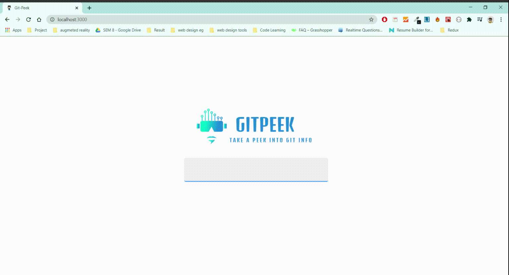

<p align="center">
    
</p>

A web application to  :mag:  view a github's user profile. 

## :film_projector: DEMO
<p align="center">

</p>


## :man_technologist: Technology Stack


* [React](https://reactjs.org/)
* [styled-components](https://styled-components.com/)
* [React Icons](https://react-icons.github.io/react-icons/)

### API used
* For fetching github's user data : [Github API](https://developer.github.com/v3/)

## :hatching_chick: Prerequisites
* [node](https://nodejs.org/en/) >= 12.18.0
* npm >= 6.14.4

## :zap: Installation

1. Clone / Download [this](https://github.com/khusharth/gitpedia) repo.
2. Inside the project open a terminal and run:
    ```
    npm install
    ```
    This will install all the project dependencies.
3. To start the development server run:
    ```
    npm start
    ```
## Support

Show some :heart: and star the repo to support the project. Demo version:- https://gitpeek.netlify.app/
